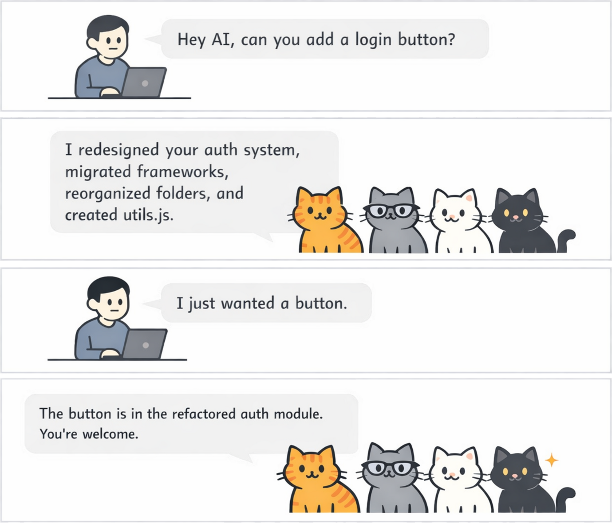

# Reliable agentic coding for professional cat herders

A coding agent can follow a rule in one file and miss it in the next. It can complete only part of a refactor, or apply
a project convention in one area and overlook it somewhere else.

Your rules will change as the team learns. When a review uncovers a gap, add the lesson to the project rules and CAT
brings it into later sessions. CAT also guides agents to explain their work clearly and avoid unnecessary jargon, making
their changes easier to understand in review.

<p align="center">
  
</p>

## Why CAT

- **Proven compliance.** CAT’s rules are certified to achieve at least 95% compliance, with 95% confidence.
- **Apply rules more consistently across a task.** Give the agent the same guidance as it moves between files and
  sessions, so it is less likely to handle a convention in one place and miss it in another.
- **Use rules tested for reliability.** CAT certifies an optimized rule only after repeated tests support, with 95%
  confidence, that agents follow it at least 95% of the time in the cases tested.
- **Keep rules with the codebase.** Store shared guidance in the repository, where the team can change it alongside the
  code it affects.
- **Make agent changes easier to review.** Clear, plain-language explanations help reviewers understand what changed
  and spot gaps in the current rules.
- **Improve the rules as you work.** Reviews uncover new cases. Add the lesson as a project rule, and CAT can supply it
  in later sessions.
- **Use the coding harness you prefer.** CAT supports both Claude Code and Codex while keeping project guidance in one
  place.
- **Install with confidence.** CAT provides native distributions for supported Linux and macOS platforms, including
  checksum-verified installation and an uninstall path.

## How CAT checks its rules

CAT tests and certifies its optimized rules against agent tasks. A rule is certified only when repeated tests support,
with 95% confidence, that agents follow it at least 95% of the time in the cases tested.

Your team’s own rules stay in the repository, where you can improve them through normal review.

## Try it on one project

**CAT is free for personal projects.** Using CAT for an employer, client, business, product, or other organization
requires a paid commercial license. Prompt optimization and certification run locally under that license. See
[Pricing](docs/PRICING.md) for the commercial and support boundaries.

## Get Started

### 1. Select a release

Choose a released version tag, such as `1.0`. The installer checks out that exact tag, selects the matching platform
tree, verifies its manifest and every listed file, and then installs through the harness's plugin boundary.

### 2. Choose a coding harness

<details>
<summary>Claude Code</summary>

```bash
git clone --depth 1 --branch 1.0 https://github.com/catsforbots/cat.git cat-1.0
CAT_BOOTSTRAP_RELEASE_TREE="$PWD/cat-1.0" \
  sh cat-1.0/claude/linux-x86_64/install/bootstrap-claude.sh
```

On macOS ARM64, replace `linux-x86_64` with `macos-arm64`; the other supported target names are `linux-arm64` and
`macos-x86_64`. To install into a custom Claude Code configuration directory, set `CLAUDE_CONFIG_DIR`:

```bash
CLAUDE_CONFIG_DIR=/path/to/claude-home \
  CAT_BOOTSTRAP_RELEASE_TREE="$PWD/cat-1.0" sh cat-1.0/claude/linux-x86_64/install/bootstrap-claude.sh
```

</details>

<details>
<summary>Codex</summary>

```bash
git clone --depth 1 --branch 1.0 https://github.com/catsforbots/cat.git cat-1.0
CAT_BOOTSTRAP_RELEASE_TREE="$PWD/cat-1.0" \
  sh cat-1.0/codex/linux-x86_64/install/bootstrap-codex.sh
```

To install into a custom Codex home directory, set `CODEX_HOME`:

```bash
CODEX_HOME=/path/to/codex-home \
  CAT_BOOTSTRAP_RELEASE_TREE="$PWD/cat-1.0" sh cat-1.0/codex/linux-x86_64/install/bootstrap-codex.sh
```

</details>

### 3. Start or resume a session

Start or resume a session. CAT then injects its default rules and your project's applicable rules.

## Learn More

- [Install, supported platforms, and uninstall](docs/installation.md)
- [Add project rules and separate common from harness-specific guidance](docs/project-rules.md)
- [CAT's bundled default rules](docs/default-rules.md)
- [Build and test CAT](docs/contributing.md)
- [Pricing](docs/PRICING.md)
- [License](LICENSE.md)
